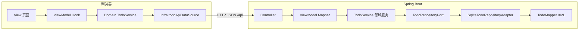

<!-- AI 生成 By Peng.Guo -->

# my-spring-boot 架构设计文档

本文档描述 **Spring Boot + SQLite** 后端与 **React + TypeScript + Vite** 前端的整体架构、分层职责与演进方向，与仓库当前实现对齐。

---

## 1. 需求理解

### 1.1 目标

- 提供可运行的 **前后端分离** 示例：浏览器端管理 Todo（列表与新建），服务端持久化到 SQLite。
- 代码结构支持 **长期演进**：新增领域能力、替换持久化或接入方式时，改动面可控。

### 1.2 系统边界

| 边界 | 说明 |
|------|------|
| 浏览器 | 运行 SPA，通过 HTTP 访问后端 `/api/*`。开发环境下 Vite 将 `/api` 代理到 `http://localhost:8080`。 |
| 后端 | 提供 REST JSON API，业务与持久化解耦；SQLite 文件默认位于 `./data/app.db`。 |
| 外部工具 | 可选使用 `scripts/sqlite-web.sh` 在本地浏览器查看数据库（与本架构数据流独立）。 |

### 1.3 隐含需求

- **分层清晰**：HTTP、DTO、领域模型、持久化模型各司其职。
- **类型明确**：TypeScript 共享类型；Java 使用 record / 接口表达契约。
- **跨域**：开发场景下允许 `http://localhost:5173` 访问后端（`WebCorsConfig`）。

---

## 2. 架构设计

### 2.1 总体结构

### 2.2 后端分层（Java）

| 层次 | 包路径（示例） | 职责 |
|------|----------------|------|
| Controller | `controller` | 仅处理 HTTP：路由、请求体验证、状态码；调用领域服务并将领域模型交给 Mapper 转为对外 DTO。 |
| ViewModel | `viewmodel` | 请求/响应 DTO（如 `CreateTodoRequest`、`TodoResponse`）与 **领域模型 → 对外表示** 的映射（`TodoViewModelMapper`）。 |
| Domain | `domain` | **领域模型**（`TodoItem`）、**领域服务**（`TodoService`）、**仓储端口**（`TodoRepositoryPort`）。不依赖 Spring Web / MyBatis。 |
| Infrastructure | `infrastructure` | 持久化模型（`TodoEntity`）、**MyBatis** `TodoMapper` + `mapper/TodoMapper.xml`、**适配器** `SqliteTodoRepositoryAdapter` 实现端口；数据源初始化、CORS 等横切配置。 |

数据流（以创建 Todo 为例）：`POST /api/todos` → `TodoController` → `TodoService.createTodo` → `TodoRepositoryPort.save` → `SqliteTodoRepositoryAdapter` → `TodoMapper` → SQLite。

### 2.3 前端分层（TypeScript）

| 层次 | 路径（示例） | 职责 |
|------|----------------|------|
| View | `frontend/src/view` | 展示与交互编排（表单提交、列表渲染）；**不直接 `fetch`**；通过 ViewModel 暴露的方法驱动行为。 |
| ViewModel | `frontend/src/viewmodel` | 页面级状态（列表、输入、加载、错误）与异步编排（`loadTodos`、`createTodo`）；组合 Domain 服务。 |
| Domain | `frontend/src/domain` | `TodoService` 依赖 `TodoDataSource` 接口，封装列表/创建及简单校验（如标题非空）。 |
| Infrastructure | `frontend/src/infra` | `todoApiDataSource`：基于 `fetch` 实现 `TodoDataSource`，路径与后端 `/api/todos` 对齐。 |
| Shared | `frontend/src/shared/types` | 前后端共享的结构类型（如 `Todo`、`CreateTodoCommand`），避免魔法字符串 scattered。 |

### 2.4 运行时集成

- **开发**：前端 `http://localhost:5173`，`vite.config.ts` 将 `/api` 代理到后端 `8080`，页面请求 `/api/todos` 即到达 Spring Boot。
- **CORS**：`WebCorsConfig` 对 `/api/**` 放行本地前端源，便于直连后端调试。

---

## 3. 抽象设计

### 3.1 后端核心抽象

| 抽象 | 职责 | 关系 |
|------|------|------|
| `TodoItem` | 领域只读快照：id、title、done、createdAt | 由仓储返回，经 Mapper 转为 `TodoResponse`。 |
| `TodoRepositoryPort` | 持久化能力契约：`save(title)`、`findAll()` | 由 Infrastructure 适配器实现，领域服务只依赖端口。 |
| `TodoService` | 用例级编排：创建前 `trim`、列表查询 | 依赖端口，不感知 SQLite/MyBatis 映射细节。 |

**生命周期**：请求进入 Controller → 领域服务单次调用内完成业务与仓储访问 → 响应 DTO 序列化为 JSON。

### 3.2 前端核心抽象

| 抽象 | 职责 | 关系 |
|------|------|------|
| `TodoDataSource` | 异步数据访问契约：`listTodos`、`createTodo` | 由 `todoApiDataSource` 实现；可替换为 Mock 或离线实现以便测试。 |
| `TodoService`（前端） | 在 DataSource 之上做展示层之前的规则（如标题校验） | ViewModel 只依赖领域 `TodoService`，不依赖 `fetch`。 |
| `useTodoViewModel` | 将异步结果写入 React 状态，暴露 `loadTodos`/`createTodo` 等 | View 仅订阅返回值与事件处理。 |

---

## 4. 设计模式运用

| 模式 | 位置 | 原因 |
|------|------|------|
| **端口-适配器（六边形）** | `TodoRepositoryPort` + `SqliteTodoRepositoryAdapter` | 领域与 MyBatis/SQLite 解耦，替换数据库或 SQL 映射时主要改适配器与 Mapper。 |
| **适配器** | `TodoViewModelMapper`、Entity → `TodoItem` 映射 | 隔离 HTTP/持久化形状与领域模型。 |
| **依赖注入** | Spring 构造器注入 Controller / Service / Repository | 便于测试与替换实现。 |
| **DataSource / Repository 抽象（前端）** | `TodoDataSource` + `todoApiDataSource` | 与 HTTP 细节解耦，利于单测与切换数据源。 |

---

## 5. 扩展与演进

### 5.1 后端

- **新用例**：在 `TodoService` 或拆分出的 Application Service 中编排；Controller 仅增加路由与 DTO。
- **领域规则变复杂**：优先留在 Domain Service，避免在 Controller 堆叠条件分支；必要时引入策略对象或规格模式替代深层 if/else。
- **替换存储**：实现新的 `TodoRepositoryPort` 适配器（或拆分端口），不改领域核心。
- **API 版本化**：可在 `/api/v1` 下新增 Controller 层或独立 DTO，渐进迁移。

### 5.2 前端

- **新接口能力**：扩展 `TodoDataSource` 与领域 `TodoService`，ViewModel 编排新状态；View 保持薄。
- **状态复杂度上升**：若多页面共享或异步依赖增多，可引入 **MobX**（或同类方案）承载可观察状态，ViewModel 转为对 Store 的编排；当前 Hook + `useState` 适合示例规模。
- **构建与部署**：生产环境可由网关或 Nginx 将 `/api` 反代到后端，或静态资源与 API 同源部署。

### 5.3 横切能力

- 统一错误模型、日志、鉴权：适合以 Filter / ControllerAdvice（后端）与 Axios 拦截器或封装 DataSource（前端）逐步引入。

---

## 6. 实现对照索引

便于读者从文档跳转到代码（路径相对仓库根目录）。

| 关注点 | 参考文件 |
|--------|----------|
| Todo REST | `src/main/java/.../controller/TodoController.java` |
| 领域服务与端口 | `domain/service/TodoService.java`、`domain/port/TodoRepositoryPort.java` |
| SQLite/MyBatis 适配 | `infrastructure/repository/SqliteTodoRepositoryAdapter.java`、`infrastructure/repository/TodoMapper.java`、`src/main/resources/mapper/TodoMapper.xml` |
| DTO 与映射 | `viewmodel/request/CreateTodoRequest.java`、`viewmodel/mapper/TodoViewModelMapper.java` |
| CORS | `infrastructure/config/WebCorsConfig.java` |
| 配置 | `src/main/resources/application.yml` |
| 前端页面 | `frontend/src/view/pages/todo/TodoPage.tsx` |
| 前端 ViewModel | `frontend/src/viewmodel/useTodoViewModel.ts` |
| 前端 Domain / Infra | `frontend/src/domain/todoService.ts`、`frontend/src/infra/http/todoApiDataSource.ts` |
| 开发代理 | `frontend/vite.config.ts` |

---

## 7. 文档修订说明

当新增模块（例如用户、认证）时，建议同步更新本文档的 **分层对照表** 与 **Mermaid 图**，保持架构描述与仓库一致。
